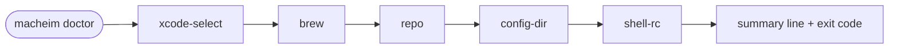

# Design — Doctor (sub-epic #10)

**Tracks:** [Index #3](https://github.com/polliard/macheim/issues/3) → [Epic #25 Foundation](https://github.com/polliard/macheim/issues/25) → sub-epic [#10](https://github.com/polliard/macheim/issues/10) → leaves [#53](https://github.com/polliard/macheim/issues/53) [#54](https://github.com/polliard/macheim/issues/54)
**Status:** Draft — awaiting user review
**Date:** 2026-05-20
**Author:** Thomas Polliard (with Claude Opus 4.7)

This is PR B of a three-PR chunk:

| PR | Sub-epic | Status |
|---|---|---|
| A | #5 | CLI shell — merged in PR #103 |
| **B (this one)** | #10 | Working `doctor`: environment sanity-check with pass/fail rendering |
| C | #8 + #47 | `internal/shell/run.go` live-streaming exec helper + migrate doctor onto it |

**Leaf mapping:**

| Spec section | Leaf issue |
|---|---|
| §4 (checks) + §5 (repo-discovery dependency) | [#53](https://github.com/polliard/macheim/issues/53) Environment checks |
| §6 (rendering) + §7 (exit codes) | [#54](https://github.com/polliard/macheim/issues/54) Output formatting + exit codes |

---

## 1. Objective

Make `macheim doctor` answer the question "would `macheim bootstrap` work today?" by running five read-only checks and rendering pass/fail rows with actionable remediation. Exit 0 if all pass, 1 if any fail. Honor `--quiet` (only failures), `--verbose` (probe details), and `--no-color` (no ANSI).

## 2. Rationale

Doctor is the first user-visible command that does real work and the first ANSI-emitting code in the project. Two design decisions cascade from that:

### Alternatives table — handling sub-epic #6 dependency

Issue #10 nominally depends on #6 (full 5-step repo discovery). Sub-issue #5 only landed steps 1–2 (`--repo` flag, `MACHEIM_REPO` env).

| Alternative | Pros | Cons | Verdict |
|---|---|---|---|
| Insert #6 between #5 and #10 | Strictest respect for the dependency graph; doctor sees full discovery on day one | Adds a 4th PR to the chunk; expands scope of the user's "make sure there is a dry-run + include a doctor" ask | Rejected |
| Skip the repo check this iteration; add post-#6 | Smallest PR B | Doctor incomplete vs #10's AC; the most useful check ("would bootstrap work?") is the absent one | Rejected |
| Minimal `config.ResolveRepoPath` now; #6 expands in place | Keeps the 3-PR chunk plan intact; doctor reports today what it can determine today; #6 lands later without touching `cmd/doctor.go` or `internal/doctor/` | Two-pass write on `ResolveRepoPath` (steps 1–2 now, steps 3–5 later) | **Chosen** |

### Alternatives table — output / ANSI infrastructure

| Alternative | Pros | Cons | Verdict |
|---|---|---|---|
| Build `internal/output/` package today | One canonical home for color/format helpers; future consumers (status #11, etc.) plug in immediately | Speculative — no second consumer yet; adds a package for one user | Rejected |
| Inline ANSI in `internal/doctor/render.go` | YAGNI; small constants + one helper; nothing to refactor until needed | Refactor needed when status (#11) lands its colored output | **Chosen** |
| Bring in `fatih/color` | Ergonomic API; TTY detection built in | Adds an external dep for the convenience of one file's worth of helpers; we'd own the same logic in a wrapper either way | Rejected |

Mitigation for the chosen path: `internal/output/` arrives in the same PR as the second consumer (likely sub-issue #11 status). The doctor code is small enough that the refactor is one diff.

### Alternatives table — check function signature

| Alternative | Pros | Cons | Verdict |
|---|---|---|---|
| Each check is a free function returning `(ok bool, remediation, probe string)` | Simplest possible signature; no struct overhead | The orchestrator has to hardcode names and order in a parallel slice; new checks land in two places | Rejected |
| Each check returns a typed `Result`; orchestrator owns a `[]Check` slice with `Name` + `Run` | One ordered list owns both metadata and behavior; new checks land in one place | One small struct definition; trivially testable | **Chosen** |
| Methods on a `Doctor` struct holding shared state | Idiomatic OO; shared state useful when checks correlate | Checks don't correlate (each is independent); shared state is YAGNI | Rejected |

### Alternatives table — testability of exec-shelling checks

`xcode-select -p` and `brew` binary detection involve filesystem and `os/exec`. Two ways to make them testable.

| Alternative | Pros | Cons | Verdict |
|---|---|---|---|
| Tests call the real binaries; `t.Skip` when absent | Tests are honest — exercise the same code path as production | Non-determinism on CI; can't test the failure path on a healthy machine | Rejected |
| Each check accepts injectable seams: `runFn func(...) (string, error)` and `statFn func(string) (os.FileInfo, error)` defaulted to `exec.Command(...).Output` and `os.Stat` | Tests can simulate any environment without hitting the disk; production path unchanged | One extra parameter per check; small ergonomic cost | **Chosen** |

This pattern is the per-PR-C choice; sub-issue #8/#47 will introduce `internal/shell/run.go` which subsumes the `runFn` parameter for every check at once.

## 3. Scope

### Files to create

- `internal/config/runtime.go` — *modify*: add `ResolveRepoPath(rt) (path, source string, err error)` (steps 1–2)
- `internal/config/runtime_test.go` — *modify*: add table tests for the resolver
- `internal/doctor/doctor.go` — `Check` struct, `Result` struct, `Run(rt, w) error` orchestrator
- `internal/doctor/checks.go` — the five check functions
- `internal/doctor/checks_test.go` — table-driven tests with mocked seams
- `internal/doctor/render.go` — pass/fail row formatting, ANSI, quiet/verbose modes, summary line
- `internal/doctor/render_test.go` — table-driven on the output bytes
- `cmd/doctor.go` — *replace stub* with handler invoking `doctor.Run`
- `cmd/doctor_test.go` — integration: exit code reflects check failures

### Files to modify

- `go.mod` / `go.sum` — `golang.org/x/term` arrives via `go mod tidy`

### Files NOT touched

- Other `cmd/*.go` stubs
- `tools.go` — `yaml.v3` still unused; #6 lands the first consumer

## 4. The five checks



Order is fixed and deterministic. Each row prints as it completes; nothing is buffered. The summary line counts failures and prints last.

### 4.1 `xcode-select`

**OK when:** `xcode-select -p` exits 0 and stdout (path) names a directory that exists.

**Probe (verbose):** `xcode-select -p → /Library/Developer/CommandLineTools` (or whatever path was returned).

**Failure remediation:** `Run: xcode-select --install`

**Failure detail:** distinguish "binary not on PATH" from "binary present but exit non-zero". Both fail; the remediation is the same.

### 4.2 `brew`

**OK when:** the arch-appropriate brew binary exists at the canonical path.

| `runtime.GOARCH` | Path |
|---|---|
| `arm64` | `/opt/homebrew/bin/brew` |
| `amd64` | `/usr/local/bin/brew` |
| anything else | check fails immediately with "unsupported architecture" |

**Probe:** the path inspected.

**Failure remediation:** `Run: macheim brew install`

### 4.3 `repo`

**OK when:** one of:
- `config.ResolveRepoPath(rt)` returns a populated path that exists as a directory and is writable.
- `ResolveRepoPath` returns `("", "", nil)` (no source configured). This is the embed-fallback case from GOALS.md and is a *valid* state.

**Probe:** the source (`--repo flag` / `MACHEIM_REPO env` / `none configured`) and the resolved path.

**Failure remediation:**
- Path configured but doesn't exist → `Clone the macheim repo to the configured path, or update --repo / MACHEIM_REPO`
- Path exists but not writable → `Check permissions on <path>`

### 4.4 `config-dir`

**OK when:** `~/.config/macheim/` exists and is writable, OR doesn't exist and parent `~/.config/` is writable (so we can create it on-demand).

**Probe:** the resolved path + whether it exists.

**Failure remediation:** `mkdir -p ~/.config/macheim && chmod u+w ~/.config/macheim`

### 4.5 `shell-rc`

**OK when:** `$SHELL` is zsh or bash, AND the appropriate rc file is writable, OR the rc file doesn't exist and `$HOME` is writable (so we can `touch` it).

| `$SHELL` ends in | rc file |
|---|---|
| `zsh` | `$HOME/.zshrc` |
| `bash` | `$HOME/.bash_profile` (macOS convention) |
| other | fail with "unknown shell" |

**Probe:** `$SHELL` value, resolved rc path, exists/writable booleans.

**Failure remediation:**
- Unknown shell → `Set SHELL to /bin/zsh or /bin/bash`
- rc file unwritable → `touch ~/.zshrc && chmod u+w ~/.zshrc` (matching the user's shell)

### 4.6 Writability test mechanism

Used by §4.3 (repo), §4.4 (config-dir), and §4.5 (shell-rc).

- **Directory writability:** call `os.MkdirTemp(dir, "macheim-doctor-")`; if it returns nil error, immediately `os.Remove` the probe directory and report writable. If it returns a permission error, report not writable. If the directory itself doesn't exist (`os.IsNotExist`), recurse upward to the parent until a writable ancestor is found OR the filesystem root is reached.
- **Existing-file writability:** `os.OpenFile(path, os.O_WRONLY|os.O_APPEND, 0)`; close immediately. The `O_APPEND` (no `O_CREATE`, no `O_TRUNC`) means the file is not modified by the probe. Open success → writable; permission error → not writable.
- **Non-existing-file writability:** treat as the parent directory's writability question.

Each probe leaves no trace on the filesystem. The implementation lives in `internal/doctor/checks.go` as small unexported helpers shared by checks 4.3 / 4.4 / 4.5.

## 5. `config.ResolveRepoPath`

Lands in this PR; minimal version covering steps 1–2 of the 5-step chain.

```go
// ResolveRepoPath returns the configured macheim repo path and the source
// that produced it ("flag" or "env"), or ("", "", nil) when no source is
// configured (the embed-fallback case from GOALS.md).
//
// Sub-issue #6 expands this to cover steps 3 (~/.config/macheim/config.yaml),
// 4 (conventional paths ~/src/macheim, ~/code/macheim), and 5 (embed fallback
// formalisation). Doctor's signature does not change when #6 lands.
func ResolveRepoPath(rt *Runtime) (path, source string, err error) {
	if rt.RepoPath != "" {
		return rt.RepoPath, "flag", nil
	}
	if v := os.Getenv("MACHEIM_REPO"); v != "" {
		return v, "env", nil
	}
	return "", "", nil
}
```

Note: `rt.RepoPath` already incorporates the `Sources: cli.EnvVars("MACHEIM_REPO")` mechanism via urfave/cli/v3's value-source chain. So in practice, the env-var fallback in `ResolveRepoPath` is only reached when `rt.RepoPath` is empty (cli's source-chain didn't pick it up either). Defensive belt-and-suspenders; documented inline.

## 6. Output rendering

### 6.1 Pass row

```
✓ <name>
```

Green `✓` (ANSI `\033[32m✓\033[0m`) when color enabled.

`--verbose` adds an indented probe line:

```
✓ xcode-select
   probed: xcode-select -p → /Library/Developer/CommandLineTools
```

### 6.2 Fail row

```
✗ <name>
   → <remediation>
```

Red `✗` (ANSI `\033[31m✗\033[0m`). Remediation always prints, regardless of `--verbose`.

`--verbose` adds the probe line *above* the remediation:

```
✗ brew
   probed: /opt/homebrew/bin/brew (not found)
   → Run: macheim brew install
```

### 6.3 Summary

Always last line:

- `All checks passed.` (green when color enabled) — exit 0
- `<N> checks failed.` (red when color enabled) — exit 1

### 6.4 `--quiet`

Skip pass rows entirely. Failures + summary still print. Exit code unchanged.

```
✗ brew
   → Run: macheim brew install
1 checks failed.
```

### 6.5 `--no-color` / non-TTY

Suppress ANSI escapes entirely when `rt.NoColor` is true OR when stdout is not a terminal. TTY detection via `golang.org/x/term.IsTerminal(int(os.Stdout.Fd()))`.

Combined truth table:

| `rt.NoColor` | `IsTerminal(stdout)` | ANSI? |
|---|---|---|
| false | true | yes |
| false | false | no |
| true | true | no |
| true | false | no |

Both signals merge to a single internal `useColor bool` evaluated once when `Render` is constructed.

## 7. Exit codes

`doctor.Run` returns:

- `nil` when all checks pass → urfave/cli exits 0.
- `cli.Exit("", 1)` when any check fails → urfave/cli's default `HandleExitCoder` invokes `cli.OsExiter(1)`. Empty message suppresses extra stderr output (the summary line is already on stdout).

The `cli.Exit` value forces exit 1 without an extra error message being printed by the framework. Reference: `urfave/cli/v3` errors.go (`HandleExitCoder`, `OsExiter`, `ExitCoder` interface).

### Testing exit codes without terminating the test process

`HandleExitCoder` calls `cli.OsExiter`, which defaults to `os.Exit`. In tests, replacing `cli.OsExiter` with a recording closure captures the exit code without ending the test binary:

```go
var captured int
prev := cli.OsExiter
cli.OsExiter = func(code int) { captured = code }
t.Cleanup(func() { cli.OsExiter = prev })

_ = root.Run(ctx, []string{"macheim", "doctor"})

if captured != 1 { t.Errorf("want exit 1, got %d", captured) }
```

This pattern is used by `cmd/doctor_test.go` only — `internal/doctor/`'s tests call `doctor.Run` directly with a synthetic writer, bypassing the cli framework entirely, so the OsExiter swap is not needed there.

## 8. Internal package layout

```
internal/doctor/
├── doctor.go        // Check struct, Result struct, Run(rt, w) error
├── checks.go        // xcodeCheck, brewCheck, repoCheck, configDirCheck, shellRCCheck
├── checks_test.go   // table-driven with injected runFn + statFn seams
├── render.go        // useColor, row formatting, summary, --quiet/--verbose
└── render_test.go   // table-driven on rendered bytes
```

### `doctor.go` skeleton

```go
package doctor

import (
	"io"

	"github.com/polliard/macheim/internal/config"
	"github.com/urfave/cli/v3"
)

type Result struct {
	OK          bool
	Probe       string
	Remediation string
}

type Check struct {
	Name string
	Run  func(rt *config.Runtime) Result
}

func DefaultChecks() []Check {
	return []Check{
		{Name: "xcode-select", Run: xcodeCheck},
		{Name: "brew",         Run: brewCheck},
		{Name: "repo",         Run: repoCheck},
		{Name: "config-dir",   Run: configDirCheck},
		{Name: "shell-rc",     Run: shellRCCheck},
	}
}

func Run(rt *config.Runtime, w io.Writer) error {
	r := newRender(rt, w)
	failed := 0
	for _, c := range DefaultChecks() {
		res := c.Run(rt)
		r.row(c.Name, res)
		if !res.OK {
			failed++
		}
	}
	r.summary(failed)
	if failed > 0 {
		return cli.Exit("", 1) // empty msg; summary already printed to w
	}
	return nil
}
```

## 9. `cmd/doctor.go`

```go
package cmd

import (
	"github.com/polliard/macheim/internal/config"
	"github.com/polliard/macheim/internal/doctor"
	"github.com/urfave/cli/v3"
)

func doctorCommand(rt *config.Runtime) *cli.Command {
	return &cli.Command{
		Name:  "doctor",
		Usage: "Sanity-check the macheim environment",
		Action: func(ctx context.Context, cmd *cli.Command) error {
			return doctor.Run(rt, cmd.Root().Writer)
		},
	}
}
```

Note: drops the `_ = rt` stub-marker line.

## 10. Testing strategy

### `internal/config/runtime_test.go` (new tests)

Table-driven against `ResolveRepoPath`:

| Case | rt.RepoPath | MACHEIM_REPO env | want path | want source |
|---|---|---|---|---|
| nothing set | "" | "" | "" | "" |
| only flag | "/repo" | "" | "/repo" | "flag" |
| only env | "" | "/env" | "/env" | "env" |
| both — flag wins | "/repo" | "/env" | "/repo" | "flag" |

Env-var manipulation uses `t.Setenv("MACHEIM_REPO", ...)`.

### `internal/doctor/checks_test.go`

Each check has injectable seams (test-only). The pattern:

```go
// xcodeCheck production entry point.
func xcodeCheck(rt *config.Runtime) Result {
	return xcodeCheckFn(rt, runCmd, osStat)
}

// xcodeCheckFn is the testable inner shape.
func xcodeCheckFn(rt *config.Runtime, run runFunc, stat statFunc) Result {
	// ...
}

type runFunc func(name string, args ...string) (stdout string, err error)
type statFunc func(path string) (os.FileInfo, error)
```

Tests call `xcodeCheckFn` directly with stub `run` and `stat`. Each check gets:
- happy path
- one or two failure paths (binary missing, exit code non-zero, path doesn't exist)

### `internal/doctor/render_test.go`

Given a list of `(name, Result)` and a synthetic `Runtime` (toggling `NoColor`, `Quiet`, `Verbose`), assert the byte output exactly.

Matrix:

| Test case | Pass count | Fail count | Quiet | Verbose | NoColor | Expected lines |
|---|---|---|---|---|---|---|
| all pass, default | 5 | 0 | f | f | t | 5 pass rows + summary |
| 1 fail, default | 4 | 1 | f | f | t | 4 pass + 1 fail (with → remediation) + summary |
| 1 fail, quiet | 4 | 1 | t | f | t | 1 fail + summary |
| 1 fail, verbose | 4 | 1 | f | t | t | 5 rows each with probed: line + summary |
| 1 fail, color | 4 | 1 | f | f | f | output contains `\033[32m`/`\033[31m`/`\033[0m` |

### `cmd/doctor_test.go`

```go
func TestDoctor_RunsAndExits(t *testing.T) {
	// Use runRoot from cmd/root_test.go; macheim doctor will hit the real
	// environment (xcode-select, brew, etc.). On a healthy dev machine, expect
	// either err == nil (all pass) or err implementing ExitCoder with code 1.
	// Either is acceptable — what we're verifying is that the wiring runs and
	// doesn't panic.
	stdout, _, _, err := runRoot(t, "doctor")
	if err != nil {
		var coder cli.ExitCoder
		if !errors.As(err, &coder) {
			t.Fatalf("unexpected error type: %v", err)
		}
		if coder.ExitCode() != 1 {
			t.Errorf("expected exit code 1 on failure, got %d", coder.ExitCode())
		}
	}
	// Either way, summary line must appear.
	if !strings.Contains(stdout, "checks") {
		t.Errorf("missing summary line in stdout:\n%s", stdout)
	}
}
```

This is a smoke test, not deterministic. The deterministic coverage lives in `internal/doctor/`'s table tests.

## 11. Risk assessment

| Risk | Likelihood | Mitigation |
|---|---|---|
| Test on CI runs xcode-select / brew shelling | Low — the testable seams are stubbed in unit tests; integration test is smoke only | Document that #23 (CI) needs neither xcode nor brew installed. |
| ANSI inlined in doctor will need extraction when #11 (status) lands | High — by design | When #11 lands, extract `internal/output/` and migrate. One-day refactor. |
| `golang.org/x/term` minor-version churn | Low | Lock via go.sum; the API surface we use (`IsTerminal`) is stable since Go 1.x. |
| `cli.Exit("", 1)` prints nothing useful on tty failure | Low — summary line is already printed before Run returns | Verified in render_test. |
| Stub doctor in cmd/ broke its issue-number reference | None | Replaced wholesale. |

## 12. Backward compatibility

Stub doctor command (commits `ad6b029`/`fff4806` on main) is replaced. No persistent state, no flag rename. Users running `macheim doctor` previously got `doctor: not implemented yet`; now they get real output. No deprecation cycle needed.

## 13. Dependencies (on other sub-issues)

- **Blocked by:** #5 (done — PR #103 merged)
- **Strictly depends on:** #6 (full repo discovery) — *worked around* by `ResolveRepoPath` minimal API. When #6 lands, doctor sees richer probe info but its contract is unchanged.
- **Blocks:** #11 (status — likely consumer of the future `internal/output/` extracted from `doctor/render.go`)

## 14. Out of scope (deferred)

- Full 5-step repo discovery → #6
- `internal/output/` extraction → folded into #11 or whichever sub-issue lands the second ANSI consumer
- `internal/shell/run.go` live-streaming exec helper → #8 / #47 (PR C of this chunk)
- `xcode-select` actual install runner → out of scope; doctor only checks. (`bootstrap` may run `xcode-select --install` in a future sub-issue.)
- Color customisation (themes, dark/light detection) → YAGNI
- JSON output mode → YAGNI

## 15. Acceptance verification

Maps each #10 / #53 / #54 AC to a verifying command:

| AC | Verifying command | Expected |
|---|---|---|
| Five checks defined | `grep -E '^\s+\{Name:' internal/doctor/doctor.go \| wc -l` | 5 |
| Failure prints remediation | `internal/doctor/render_test.go::TestRender_FailRowIncludesRemediation` | passes |
| Exit non-zero on failure | `cmd/doctor_test.go::TestDoctor_RunsAndExits` (smoke) + `internal/doctor/doctor_test.go::TestRun_ReturnsExitCoder_OnFailure` | passes |
| `--quiet` hides passes | `internal/doctor/render_test.go::TestRender_QuietSkipsPasses` | passes |
| `--verbose` shows probes | `internal/doctor/render_test.go::TestRender_VerboseShowsProbes` | passes |
| `--no-color` suppresses ANSI | `internal/doctor/render_test.go::TestRender_NoColorStripsANSI` | passes |
| Each check returns structured result | `Check` and `Result` types compile, `_ = c.Run(rt).Probe` exercises field | inherent |

Plus the regression checks inherited:

| Check | Command | Expected |
|---|---|---|
| Build | `make build` | exit 0 |
| Tests | `make test` | exit 0 |
| Lint | `make lint` | `0 issues` |

## 16. Commit plan

Four commits (each independently passes `make lint && make test`):

1. `feat(config): add ResolveRepoPath for steps 1-2 of repo discovery` — `internal/config/runtime.go` + test rows.
2. `feat(doctor): add five environment checks behind a testable seam` — `internal/doctor/doctor.go` (Check/Result types, DefaultChecks, Run-orchestrator skeleton) + `internal/doctor/checks.go` + `internal/doctor/checks_test.go`. Render not landed yet; Run accepts a writer but writes nothing (lint quiet via `_ = w`).
3. `feat(doctor): add output rendering with quiet/verbose/no-color and TTY detection` — `internal/doctor/render.go` + `render_test.go`. Run wires render in. `golang.org/x/term` arrives via `go mod tidy`.
4. `feat(cmd): replace doctor stub with real handler; close #10` — `cmd/doctor.go` swaps stub body for `doctor.Run(...)`. `cmd/doctor_test.go` smoke test.

Closing line on commit 4:

```
Closes #10
Closes #53
Closes #54
```
