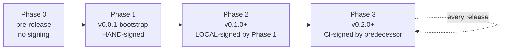

# ADR 0007 — Release: Dogfood + goreleaser, with Bootstrap On-Ramp

| Status | Accepted   |
|--------|------------|
| Date   | 2026-05-21 |

## Context

MacForge is a tool for signing and notarizing macOS binaries. Its own binary needs to be signed and notarized. There are two questions:

1. **What signs MacForge's releases?** Apple's CLI directly, a third-party signing GitHub Action, or MacForge itself?
2. **How do we get there from a cold start?** MacForge can't sign its first release with itself — the binary doesn't exist yet.

The strongest possible quality signal is dogfooding: if MacForge can't sign its own release, MacForge isn't shippable. The challenge is the bootstrap.

## Decision

**Dogfood + goreleaser**, with an explicit four-phase bootstrap on-ramp:



### Phase 0 — Pre-release

- CI: lint, unit (tier 1), integration (tier 2). Cross-compile darwin/amd64, darwin/arm64, linux/amd64, windows/amd64 to verify it builds.
- No signing. Artifacts are draft only.

### Phase 1 — Bootstrap release (`v0.0.1-bootstrap`)

One-time manual procedure, from a Mac:

```bash
# 1. Build
go build -trimpath -o bin/macforge ./cmd/macforge

# 2. Sign manually with existing Developer ID identity
codesign --sign "Developer ID Application: <Org> (<TEAM>)" \
         --options runtime \
         --timestamp \
         ./bin/macforge

# 3. Package and notarize
zip -j ./bin/macforge.zip ./bin/macforge
xcrun notarytool submit ./bin/macforge.zip \
      --keychain-profile macforge-prod \
      --wait

# 4. Verify the zip notarization status; signed binary inside is the artifact.
#    (Standalone CLI binaries aren't staplable; Gatekeeper checks the signature.)

# 5. Upload to GitHub Release as v0.0.1-bootstrap.
```

This release is the seed of the chain. It is human-blessed, not MacForge-blessed.

### Phase 2 — Local alpha (`v0.1.0`+)

- Use Phase-1 `macforge` locally to run `macforge release` against a fresh local build.
- Proves the full pipeline (build → sign → package → notarize → verify → publish) against MacForge's own binary on your Mac.
- Tag and upload.

### Phase 3 — CI-signed (`v0.2.0`+, steady state)

- goreleaser builds binaries and creates GitHub Release scaffolding.
- GitHub Actions downloads the **previous** `macforge` release (pinned by tag), uses it to run `sign`, `package`, `notarize`, `verify`, `publish`.
- Every release from this point is signed by its predecessor. The chain is self-perpetuating.

### Release infrastructure

- **goreleaser** for binary builds, archive creation, checksum manifest, GitHub Release boilerplate.
- **macforge** for signing, notarization, verification, publishing — replaces third-party signing actions.
- **One consolidated GitHub Actions secret named `PACKAGE_PUBLISH_TOKEN`** per `Code.md §5`. Org-level. Write access to GitHub Releases, Homebrew tap, and any future package destinations.
- **Reproducible-ish builds:** `-trimpath`, `-buildvcs=true`, pinned Go toolchain (`.go-version`), no `replace` directives in `go.mod`.

## Consequences

### Positive

- **Strongest possible quality signal.** A release that can't be signed by the previous release fails immediately and visibly.
- **No third-party signing-actions dependency** after Phase 1.
- **Audit log of every release is itself published** as a release artifact (`macforge-audit-<version>.jsonl`, consolidated by trace per ADR-0012).
- **Bootstrap is honest** — one documented manual step, not hidden magic.

### Negative

- **A broken release breaks the chain.** If `vN-1` cannot sign `vN`, recovery means a manual bootstrap to `vN`. Mitigation: every CI release runs `macforge verify` against the new artifact before publication.
- **goreleaser dependency** adds a tool to learn and maintain.
- **macOS-only signing path** in CI means a darwin runner (GitHub's `macos-14`+ hosted runners are fine; self-hosted optional).

### Neutral

- Phase 1 is a once-per-project event. The manual cost is paid once.

## Alternatives Considered

| Alternative | Pros | Cons | Verdict |
|-------------|------|------|---------|
| **Dogfood + goreleaser + bootstrap** | Strongest quality signal; self-perpetuating chain; published audit | Chain break recovers via manual bootstrap | **Chosen** |
| Dogfood, hand-rolled release script | No goreleaser dep | Reinventing goreleaser's wheels (checksums, multi-arch archive layout, release-notes generation) | Rejected — goreleaser is solid and well-maintained |
| Ship unsigned binaries first, dogfood later | Faster to v0.1 | Users distrust an unsigned signing tool; loses the v0.x quality signal | Rejected — bad first impression for a trust tool |
| goreleaser + codesign-action (third-party) | Pragmatic in the short term | Mixed-signal: we ship with someone else's signing tool. Defeats the purpose of MacForge existing | Rejected — undermines the mission |

## Links

- Spec §11: [Release Chain](../superpowers/specs/2026-05-21-macforge-architecture-design.md#11-release-chain-bootstrap--self-perpetuating)
- Related: [ADR-0009](0009-github-action-separate-repo.md), [ADR-0014](0014-keychain-naming-convention.md)
- Reference: `Code.md §5` (release-publishing secret consolidation)
