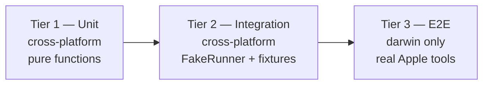

# ADR 0013 — Testing Strategy: Three Tiers

| Status | Accepted   |
|--------|------------|
| Date   | 2026-05-21 |

## Context

MacForge is mostly a shim between contributors' macOS expectations and Apple's CLI tools. The hard parts to test:

- **Real Apple tools** require a darwin host with a configured keychain and an Apple Developer account.
- **Apple's notarization API** is a live external dependency with rate limits.
- **Most contributors don't run macOS** — Linux/Windows contributors must be able to validate their changes.
- **Stdout/stderr parsing** is brittle across macOS versions; tests need to pin expected shapes.

The strategy must keep the fast tests fast and cross-platform, while still proving real Apple integration where it counts.

## Decision

Three tiers, each with a distinct purpose and gating model:



### Tier 1 — Unit

- **Scope:** pure functions; no `os/exec`, no filesystem, no network.
- **Targets:** config parsing, error formatting, output rendering, audit JSONL marshaling, command-argv construction (the *string-building* side of `apple/*` wrappers), `errors.Is/As`.
- **Location:** `*_test.go` beside the code under test. **No build tag.**
- **CI:** runs on every PR, on `linux/amd64`, `darwin/arm64`, and `windows/amd64`. Fast; the whole tier ≤ 10s.

### Tier 2 — Integration via `FakeRunner`

- **Scope:** wire up real subsystem code paths end-to-end, with `FakeRunner` standing in for Apple tools. Fixtures live under `testdata/<tool>/<scenario>/`.
- **Targets:** `signing.Sign`, `notarize.Submit`, the full `release` pipeline, error propagation through subsystems, audit-log content (every test asserts the JSONL it produced), output renderers under both human and JSON mode.
- **Location:** `internal/<pkg>/<feature>_integration_test.go`. **Build tag:** `//go:build integration`.
- **CI:** runs on every PR, cross-platform. Slower than tier 1 (≤ 2 min) but still cheap.

#### Fixture format

```
testdata/codesign/sign-success/
├── inv.json        the Invocation expected to arrive at the Runner
├── stdout          captured real Apple tool stdout (bytes)
├── stderr          captured real Apple tool stderr (bytes)
└── exit            single integer: exit code
```

`FakeRunner.Run(inv)` matches `inv` against `inv.json` (subset match; missing fields are wildcards). The matching tuple wins; if no fixture matches, the test fails with a diagnostic listing the un-matched fixtures.

#### Fixture recording

`macforge --record-fixtures=./testdata/...` runs a real flow against a real Apple environment and writes fixtures. Recorded fixtures get committed. Re-recording is explicit, never automatic — drift fails tests, doesn't get papered over.

### Tier 3 — E2E on real macOS

- **Scope:** real `codesign`, real `xcrun notarytool`, real keychain, real Apple App Store Connect (or its sandbox, where possible).
- **Targets:** keychain create/import/delete; sign a fixture `.app`; notarize against Apple staging; verify with `spctl`; full `macforge release` against a tiny fixture project.
- **Location:** `e2e/*_e2e_test.go`. **Build tag:** `//go:build darwin && e2e`.
- **CI:** runs on a GitHub `macos-14` (or newer) runner. **Triggered:** nightly + on release tag + on PRs touching `internal/apple/*` (label-gated).
- **Secrets required:** `MACFORGE_E2E_TEAM`, `MACFORGE_E2E_ASC_PROFILE`, `MACFORGE_E2E_KEYCHAIN_PASSWORD`, plus a long-lived test cert in the runner's keychain (set up once via a self-hosted runner if Apple's notarization API forbids per-job certs).

## Test discipline

- **Bug fixes start with a failing regression test.** Per `Code.md §3` and `§11.4`. The test stays in the suite forever.
- **Flaky tests are quarantined or fixed within one sprint.** Per `Code.md §3`. Quarantine means `t.Skip("FLAKY: tracked in #NNN")` with a tracked issue.
- **No test without an assertion.** A test that runs code without checking output is a smell; the linter flags it.
- **Test names read as specifications.** `it_rejects_orders_below_minimum` style. `Test_Sign_RejectsUnsignedKeychain`.
- **Behavior, not implementation.** A refactor that preserves behavior should not change any test (per `Code.md §11.3`).

## Coverage targets

| Tier | Coverage target | Enforcement                                                          |
|------|----------------|----------------------------------------------------------------------|
| 1    | ≥ 80% line     | `go test -cover` in CI; PR fails below threshold.                    |
| 2    | All happy paths + all `MF-*` codes have at least one fixture. | Lint script checks every code constant has a fixture under `testdata/`. |
| 3    | One scenario per CLI verb. | Manual code review; tier-3 churn is intentional.                       |

## CI matrix

| Job                              | OS               | Tier   | Trigger                  |
|----------------------------------|------------------|--------|--------------------------|
| `lint`                           | linux            | —      | every push               |
| `unit-linux` / `darwin` / `win`  | each             | 1      | every push               |
| `integration-linux` / `darwin`   | each             | 1+2    | every push               |
| `e2e-darwin`                     | macos-14         | 1+2+3  | nightly, release tag, label `e2e:run` |

## Consequences

### Positive

- **Most tests run anywhere, fast.** Onboarding from Linux is friction-free.
- **Tier 2 catches argv-construction and stdout-parsing regressions** without needing a Mac.
- **Tier 3 proves the real story** before each release.
- **Fixture drift is loud.** A macOS version that changes `codesign --display` output breaks tier 2 immediately; we update the fixture deliberately, not silently.

### Negative

- **Tier 3 needs an Apple Developer account and infrastructure.** Cost (Apple's $99/year + GitHub macOS runner minutes) is the price of a real audit story.
- **Fixture maintenance** is real work; a macOS major version may require updating ~dozens of fixtures.

### Neutral

- The tier model is reflected in package documentation (`internal/<pkg>/README.md` notes which tier covers what).

## Alternatives Considered

| Alternative | Pros | Cons | Verdict |
|-------------|------|------|---------|
| **Three tiers (unit / fake / real)** | Speed + portability + real verification, all addressed | Fixture maintenance | **Chosen** |
| Two tiers (unit + real-only integration) | Simpler | Pushes most contributors to "can't validate locally" — toxic for OSS health | Rejected |
| Single-tier with mock interfaces only | Trivial setup | Never proves the real integration; tier-3 truth gap is unacceptable for a trust tool | Rejected |
| Property-based testing (gopter) overlaid | Could prove invariants like "round-trip audit serialization" | Worth doing inside tier 1 for select properties; not a tier of its own | Adopt selectively inside tier 1 |

## Links

- Spec §10: [Testing Strategy](../superpowers/specs/2026-05-21-macforge-architecture-design.md#10-testing-strategy)
- Reference: `Code.md §3` (testing pyramid, flaky test handling), `Code.md §11.4` (debug protocol)
