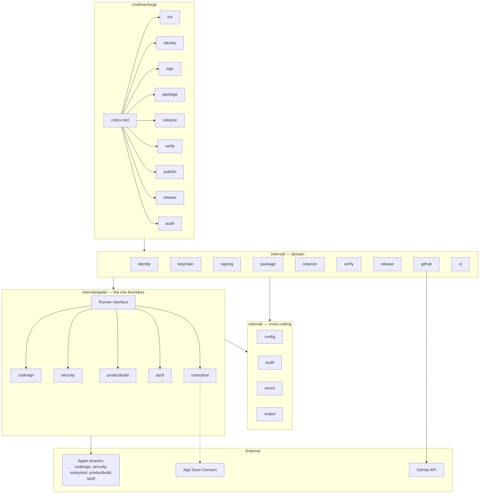
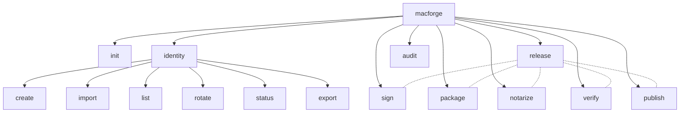
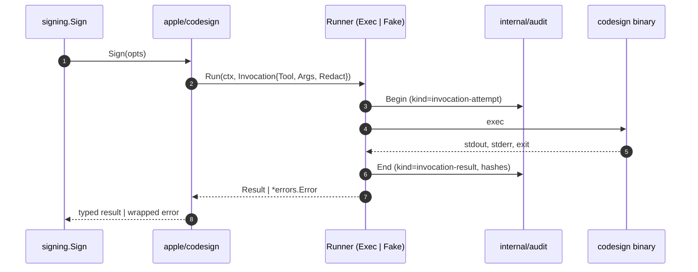
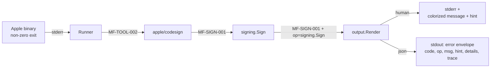
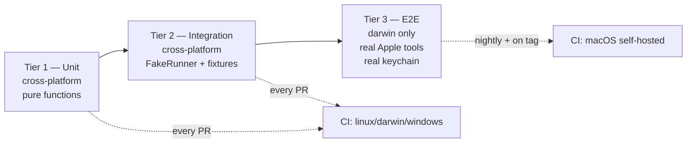
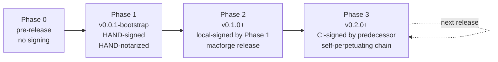

# MacForge — Architecture Design

| Status      | Approved                                                         |
|-------------|------------------------------------------------------------------|
| Date        | 2026-05-21                                                       |
| Author      | Thomas Polliard                                                  |
| Drafted by  | Claude Code (Opus 4.7, 1M)                                       |
| Source      | `GOALS.md` + brainstorming session 2026-05-21                    |

This document is the architectural foundation for MacForge. It establishes the cross-cutting structure, names the load-bearing decisions, and links each decision to its own [MADR](https://adr.github.io/madr/) record under `docs/adr/`.

The spec itself is the index. Each decision lives in its own ADR — single-purpose, dated, immutable once accepted (superseded by a new ADR, never edited in place).

---

## 1. Mission Tie-in

From `GOALS.md`:

> MacForge is civilization-grade Apple release infrastructure for macOS software. It provides deterministic, auditable, repeatable Apple signing, certificate lifecycle management, CI secret management, packaging, notarization, verification, and publishing for macOS software distributed outside the App Store.

Three principles drive the architecture below:

- **Deterministic.** Same inputs → same outputs. The audit log is the artifact of truth; replays are byte-equal.
- **Auditable.** Every Apple invocation, every state transition, every decision is recorded in a JSONL audit log with a stable schema.
- **Reproducible.** Pinned toolchain, locked dependencies, hermetic builds, and a release chain that signs itself with its own predecessor.

---

## 2. High-Level Architecture



**Boundary rule:** every shell-out to an Apple binary flows through `internal/apple/*`. The rest of the codebase depends on per-tool interfaces, never on `os/exec`. This gives one mockable seam, one audit hook, and one redaction point.

---

## 3. Decision Catalog

Fourteen foundational decisions, each captured as a standalone ADR.

| ADR    | Title                                        | Status   |
|--------|----------------------------------------------|----------|
| [0001](../../adr/0001-language-go.md)                          | Language: Go                                  | Accepted |
| [0002](../../adr/0002-project-layout-cmd-internal.md)          | Project layout: `cmd/` + `internal/`          | Accepted |
| [0003](../../adr/0003-apple-tool-boundary-shell-out.md)        | Apple-tool boundary: shell-out only           | Accepted |
| [0004](../../adr/0004-dependency-stack.md)                     | Dependency stack: cobra + viper + zerolog     | Accepted |
| [0005](../../adr/0005-state-and-config-layout.md)              | State and config layout: hybrid               | Accepted |
| [0006](../../adr/0006-output-format-dual.md)                   | Output format: dual (human + json)            | Accepted |
| [0007](../../adr/0007-release-dogfood-and-bootstrap.md)        | Release: dogfood + goreleaser, with bootstrap | Accepted |
| [0008](../../adr/0008-license-apache-2.0.md)                   | License: Apache 2.0                           | Accepted |
| [0009](../../adr/0009-github-action-separate-repo.md)          | macforge-action: separate repository          | Accepted |
| [0010](../../adr/0010-package-naming-reconciliation.md)        | Package naming reconciliation                 | Accepted |
| [0011](../../adr/0011-error-model-and-codes.md)                | Error model: sentinels + stable codes         | Accepted |
| [0012](../../adr/0012-audit-log-schema.md)                     | Audit log: JSONL with `Common.md §5.2` vocabulary | Accepted |
| [0013](../../adr/0013-testing-strategy-three-tiers.md)         | Testing strategy: three tiers                 | Accepted |
| [0014](../../adr/0014-keychain-naming-convention.md)           | Keychain naming convention                    | Accepted |

---

## 4. Module Organization (final)

```
macforge/
├── cmd/macforge/                  entrypoint; wires cobra root
├── internal/
│   ├── apple/                     THE boundary — only place that shells out
│   │   ├── codesign/
│   │   ├── security/
│   │   ├── notarytool/
│   │   ├── productbuild/
│   │   ├── spctl/
│   │   └── runner.go              Runner interface + ExecRunner + FakeRunner
│   ├── identity/                  cert/key/CSR lifecycle
│   ├── keychain/                  dedicated keychain lifecycle
│   ├── signing/                   sign orchestration
│   ├── package/                   zip/dmg/pkg/app
│   ├── notarize/                  submit→wait→staple
│   ├── verify/                    codesign + spctl + Gatekeeper
│   ├── release/                   end-to-end pipeline
│   ├── github/                    GitHub Releases client
│   ├── ci/                        CI provider detection + helpers
│   ├── config/                    macforge.yaml + viper layering
│   ├── audit/                     JSONL writer + redactor
│   ├── errors/                    sentinels + codes + envelope
│   └── output/                    human vs JSON renderers
├── docs/
│   ├── adr/                       MADR records (0001…)
│   └── superpowers/specs/         design specs (this file)
├── examples/                      sample macforge.yaml + workflows
├── testdata/                      tier-2 fixtures
└── e2e/                           tier-3 darwin-only end-to-end tests
```

### Naming reconciliation (per [ADR-0010](../../adr/0010-package-naming-reconciliation.md))

Changes against the bootstrap scaffold:

| Bootstrap directory | Final name      | Rationale                                                |
|---------------------|-----------------|----------------------------------------------------------|
| `internal/notary`   | `internal/notarize`   | Match GOALS.md verb; verb-based packages dominate Go internal |
| `internal/build`    | `internal/release`    | Match GOALS.md `release` verb; "build" was ambiguous     |
| (missing)           | `internal/ci`         | Listed in GOALS.md internal systems; add                 |
| (missing)           | `internal/audit`      | Cross-cutting; add                                       |
| (missing)           | `internal/errors`     | Cross-cutting; add                                       |
| (missing)           | `internal/output`     | Cross-cutting; add                                       |
| (missing)           | `internal/identity`   | Distinct from `keychain`; add                            |
| `internal/verify`   | `internal/verify`     | Keep — idiomatic Go verb package                          |

---

## 5. CLI Surface



**Global flags** (inherited by every command):

```
--config <path>             default: ./macforge.yaml → ~/Library/.../config.yaml
--output human|json         default: human, auto json when GITHUB_ACTIONS=true
--log-level error|warn|info|debug|trace
--team-id <id>              overrides config team selection
--dry-run                   show planned Apple invocations; emit zero
--no-color                  disable ANSI (also honors NO_COLOR)
-v, --verbose               shortcut for --log-level=debug
```

---

## 6. Apple-Tool Boundary



The `Runner` interface is the only thing that touches `os/exec`. `ExecRunner` is real; `FakeRunner` replays fixtures from `testdata/`. Tier-2 integration tests use the fake; tier-3 e2e tests use the real one on darwin.

See [ADR-0003](../../adr/0003-apple-tool-boundary-shell-out.md).

---

## 7. State Layout

```
<repo>/
├── macforge.yaml             committed; project config
└── .macforge/                gitignored; ephemeral
    ├── audit/<UTC>.jsonl
    ├── runs/<trace>/
    └── cache/

~/Library/Application Support/MacForge/
├── config.yaml               global defaults, team registry
├── identities/<team>.json    metadata only — keychains live in ~/Library/Keychains/
├── audit/                    optional cross-project mirror
└── credentials/              asc-credentials profile metadata (never raw secrets)

~/Library/Keychains/macforge-<team>-<purpose>.keychain-db   (managed by macOS)
```

See [ADR-0005](../../adr/0005-state-and-config-layout.md) and [ADR-0014](../../adr/0014-keychain-naming-convention.md).

---

## 8. Audit Log

JSONL, append-only, daily-rotated, written to `./.macforge/audit/<UTC>.jsonl`. Field vocabulary deliberately mirrors `~/.ai/Common.md §5.2` so the same grep patterns work across MacForge logs, AI-tool interaction logs, and any other Polliard governance audit stream.

Example:

```json
{"chronon":"2026-05-21T14:30:22.481Z","trace":"01HVQK","cwd":"/work/app","actor":"macforge","kind":"invocation-attempt","probe":"codesign","probe_payload":"--sign 'Developer ID Application: ACME (XYZ1234567)' --options runtime --timestamp ./build/MyApp.app"}
{"chronon":"2026-05-21T14:30:23.117Z","trace":"01HVQK","cwd":"/work/app","actor":"macforge","kind":"invocation-result","probe":"codesign","exit":0,"duration_ms":636,"stdout_sha256":"e3b0c4","stderr_sha256":"adcb1f","artifact_sha256":"7a91","redacted":[]}
```

Schema is versioned; rotation is daily by UTC; redaction is applied before write per `Common.md P4`. Stdout/stderr stored as `sha256` digests by default; `--audit-bodies` opts into full bodies.

See [ADR-0012](../../adr/0012-audit-log-schema.md).

---

## 9. Error Model

Every error reaches the user with three components: a stable **code**, an **op** (caller context), and a wrapped **cause**.



Code namespace: `MF-<SUBSYSTEM>-NNN`. Subsystems: `IDENT`, `KEYCHAIN`, `SIGN`, `PACKAGE`, `NOTARIZE`, `VERIFY`, `PUBLISH`, `TOOL`, `CONFIG`, `AUDIT`, `OUTPUT`.

See [ADR-0011](../../adr/0011-error-model-and-codes.md).

---

## 10. Testing Strategy

Three tiers:



Tier 1 has no build tag. Tier 2 uses `//go:build integration`. Tier 3 uses `//go:build darwin && e2e`. Fixtures are recorded with `--record-fixtures` and committed.

See [ADR-0013](../../adr/0013-testing-strategy-three-tiers.md).

---

## 11. Release Chain (Bootstrap → Self-Perpetuating)



After Phase 3 begins, every release is signed by the previous release's `macforge` binary, downloaded by tag in CI. If MacForge can't sign its own release, it can't ship — the strongest possible quality signal.

See [ADR-0007](../../adr/0007-release-dogfood-and-bootstrap.md).

---

## 12. Out of Scope (this design pass)

The following are deliberately *not* decided here. They get their own design + ADRs when they matter:

- **Observability beyond the audit log** — metrics, traces (OpenTelemetry?), no commitment yet.
- **Telemetry / phone-home** — current default is none; if added later, opt-in only with explicit consent.
- **Plugin model** — no third-party extension surface in v0.x. Reconsider after v1.
- **GitLab and Azure CI integrations** — listed in GOALS.md; sketched at the package level (`internal/ci`) but not designed.
- **Provenance / SLSA attestation** — desired (per GOALS "Artifact attestations") but warrants its own ADR.
- **Reproducible builds beyond `-trimpath`** — full SOURCE_DATE_EPOCH, locked `go env` audit, etc. — future.
- **Versioning policy** — SemVer is the default assumption; explicit ADR deferred until first breaking change is on the horizon.
- **Cross-team multi-tenant CI** — implied by GOALS "Multi-team support" but the deep design waits for a real second-team use case.

---

## 13. Open Questions (carried forward)

None blocking. The decisions in this pass unblock implementation of the v0.1 vertical slice (identity → keychain → sign → verify), which is the next planning artifact via `superpowers:writing-plans`.

---

## 14. Provenance

- Brainstorming session: 2026-05-21
- Skill: `superpowers:brainstorming` v5.1.0
- Governance: `~/.ai/Constitution.md` v0.3; `~/.ai/Common.md` v0.13; `~/.ai/Code.md` v0.5
- Format: this spec follows the brainstorming-skill convention; ADRs follow MADR.
