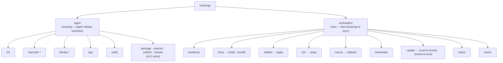
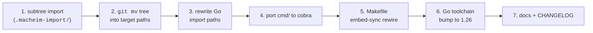

# 2026-05-21 — `workstation` verb group: merge `polliard/macheim` into `convergent-systems-co/macforge`

- **Status:** Approved (brainstorm 2026-05-21, this branch: `macheim`)
- **Owner:** Thomas Polliard
- **Supersedes:** none
- **Superseded by:** none
- **Related ADRs:** [`docs/adr/0015-single-global-config-xdg.md`](../../adr/0015-single-global-config-xdg.md), [`docs/adr/0006-output-format-dual.md`](../../adr/0006-output-format-dual.md), commit 6eecb8e (apple-verb-grouping precedent)

## 1. Context

`macforge` (this repo, `github.com/convergent-systems-co/macforge`) is the Apple release toolchain — signing, notarization, packaging, publishing. Today it exposes one verb group: `macforge apple <verb>`, established in commit 6eecb8e.

`macheim` (`github.com/polliard/macheim`) is a separate Go CLI for macOS workstation bootstrap — Homebrew, dotfiles, zsh, macOS defaults, embedded fallback for fresh-Mac setup. 73 commits, foundation complete, most mutating verbs still stubbed.

Both are macOS-shaped Go CLIs maintained by the same author. Operating two repos is duplicative; the two surfaces are complementary (release-side tooling and machine-side tooling) and deserve to live behind one binary.

**Goal:** Fold `macheim` into `macforge` as a peer verb group `macforge workstation <verb>`, preserving macheim's git history, with one consistent cobra/viper command surface.

## 2. Decisions locked in brainstorm

| # | Decision | Choice | Rejected alternatives |
|---|---|---|---|
| Q1 | History preservation | `git subtree add --prefix=... main` (preserves 73 commits) | One-commit `git read-tree`; flat `cp -R` |
| Q2 | CLI framework reconciliation | Rewrite macheim `cmd/` to cobra (one consistent surface) | Two frameworks in one binary; defer rewrite to later branch |
| Q3 | Package layout | Nest under `internal/workstation/{brew,config,doctor,...}` | Flat at `internal/` with collider renames; top-level `macheim/` directory |
| Q4 | Root-level artifacts | `examples/workstation/` for samples; `internal/workstation/embedded/configs/` for embedded fallback | Top-level `workstation/` content dir; embed-only with no sample |
| Q5 | Upstream `polliard/macheim` repo | Delete outright after merge lands (user runs `gh repo delete`) | Archive + redirect README; bidirectional `git subtree push`; leave alone |

## 3. Architecture

### 3.1 Command surface



`workstation` is a peer of `apple`, not a child of it. No cross-group dependencies. A user of only the Apple toolchain pays no Brewfile-parsing cost at startup; a user of only the workstation tooling pays no codesign-shelling cost.

### 3.2 Repo layout (post-merge)

```
macforge/
├── README.md                          # macforge identity, gains a "Workstation" section
├── CHANGELOG.md                       # gains an entry
├── go.mod / go.sum                    # cobra/viper only; urfave/cli/v3 dropped
├── Makefile                           # gains embed-sync target
├── cmd/macforge/
│   ├── root.go                        # cobra root; mounts apple + workstation
│   ├── apple_cmd.go                   # existing
│   ├── workstation_cmd.go             # NEW — workstation group root
│   ├── workstation_brew_cmd.go        # NEW
│   ├── workstation_dotfiles_cmd.go    # NEW
│   ├── workstation_zsh_cmd.go         # NEW
│   ├── workstation_macos_cmd.go       # NEW
│   ├── workstation_downloads_cmd.go   # NEW
│   ├── workstation_update_cmd.go      # NEW
│   ├── workstation_status_cmd.go      # NEW
│   ├── workstation_doctor_cmd.go      # NEW
│   └── workstation_bootstrap_cmd.go   # NEW
├── docs/
│   ├── adr/                           # existing
│   ├── superpowers/specs/             # existing — this file lives here
│   └── workstation/specs/             # NEW — moved from macheim/docs/superpowers/specs/
├── examples/
│   ├── apple/                         # existing
│   └── workstation/                   # NEW
│       ├── Brewfile                   # moved from macheim/Brewfile
│       └── config.yaml                # moved from macheim/examples/config.yaml
└── internal/
    ├── apple/, audit/, build/, ci/, config/, errors/,
    ├── github/, identity/, keychain/, notary/, output/,
    ├── package/, signing/, verify/    # all existing, untouched
    └── workstation/                   # NEW
        ├── brew/                      # from macheim/internal/brew
        ├── config/                    # from macheim/internal/config (workstation-scoped)
        ├── doctor/                    # from macheim/internal/doctor
        ├── dotfiles/                  # from macheim/internal/dotfiles
        ├── embedded/                  # from macheim/internal/embedded
        │   └── configs/Brewfile       # embed-sync target
        ├── gitrepo/                   # from macheim/internal/gitrepo
        ├── output/                    # from macheim/internal/output (workstation-scoped)
        ├── shell/                     # from macheim/internal/shell
        └── status/                    # from macheim/internal/status
```

Two `config` and two `output` packages coexist, namespaced by parent path (`internal/config` vs `internal/workstation/config`). No merge attempt — the macforge-side ones serve Apple identity config; the workstation-side ones serve Brewfile/repo discovery config. Different schemas, different lifetimes.

## 4. Migration mechanics

The work runs on this worktree's existing branch (`macheim`) and lands as a sequence of small, reviewable commits. Each commit compiles green on its own except where explicitly noted.



| # | Commit | Verb prefix | What it does | Compiles? |
|---|---|---|---|---|
| 1 | `feat(workstation): import macheim via git subtree` | feat | `git subtree add --prefix=.macheim-import https://github.com/polliard/macheim.git main`. Whole macheim tree lands at `.macheim-import/`; subtree merge commit preserves 73 commits in macforge log. Commit body references `polliard/macheim@<sha>` for future archaeology. | yes (the imported tree compiles standalone; macforge build path unchanged) |
| 2 | `refactor(workstation): relocate macheim tree into target paths` | refactor | `git mv` operations per §3.2. Delete duplicates (`.macheim-import/cmd/`, `README.md`, `GOALS.md`, `Makefile`, `go.mod`, `go.sum`, `LICENSE`, `NOTICE`, `main.go`, `tools.go`, `Brewfile` at import-root after copying to examples, etc.). `.macheim-import/` removed at end of commit. | no — Go imports still point at `github.com/polliard/macheim/...` (fixed in #3) |
| 3 | `refactor(workstation): rewrite Go import paths` | refactor | sed across `internal/workstation/**/*.go`: `github.com/polliard/macheim/internal/<pkg>` → `github.com/convergent-systems-co/macforge/internal/workstation/<pkg>`. Update `go.mod` minimally. `gopkg.in/yaml.v3` → `go.yaml.in/yaml/v3` (macforge's yaml dep) with any required call-site adjustments. | yes (internal packages compile; `cmd/` for workstation does not yet exist) |
| 4 | `feat(workstation): port command tree to cobra` | feat | Implement `cmd/macforge/workstation_*.go`. Each cobra command delegates to existing `internal/workstation/<pkg>` functions exactly as macheim's urfave/cli handlers did. Stubs use the macforge "not implemented yet (see issue #N)" idiom from commit 6eecb8e. Replace the single `cli.Exit("", 1)` call in `internal/workstation/doctor/doctor.go` with a sentinel error returned to cobra (so the cli dep drops cleanly). Drop `github.com/urfave/cli/v3` from `go.mod`. **`golang.org/x/term` stays** — `internal/workstation/output/output.go` uses it for TTY detection. | yes — binary now has both verb groups |
| 5 | `build(workstation): rewire Makefile embed-sync` | build | Re-target the macheim embed-sync rule to copy `examples/workstation/Brewfile` → `internal/workstation/embedded/configs/Brewfile`. Fold into macforge's existing Makefile (which already has help/clean/build/test from commit 6f567a5). `make build` depends on `make embed-sync`. | yes |
| 6 | `ci(workstation): align Go toolchain to 1.26` | ci | Bump `go.mod`'s `go` directive from `1.24` → `1.26` (macheim's floor, and within Go's supported window). Update `.go-version` if present. Update CI workflow matrix accordingly. macheim's previous `ci: fix lint Go-version mismatch` (commit 95d7db5) established that the repo already cares about this; this commit moves the floor. | yes |
| 7 | `docs(workstation): README + CHANGELOG` | docs | Add a Workstation section to `README.md` (a sibling row group to the existing v0.1 status table at lines 33–45). Append CHANGELOG entry crediting the polliard/macheim subtree merge with the head sha at time of import. | yes |

### 4.1 Why `--squash=false`

Default `git subtree add` uses `--squash`, which collapses macheim into a single commit on the macforge merge-base. We want the 73-commit history visible in `git log -- internal/workstation/` so `git blame` works downstream. Cost is a noisier `git log --oneline` immediately after the merge; benefit is permanent provenance.

### 4.2 `git mv` discipline in commit #2

Each move is an explicit `git mv <src> <dst>` rather than `mv + git add`, so git records the move and `git log --follow` traces history across the rename for every workstation file.

## 5. Configuration, flags, env namespacing

### 5.1 Global flag reconciliation

macheim today exposes these globals (from `macheim/cmd/root.go`):

| macheim flag | macheim env | macforge equivalent | Notes |
|---|---|---|---|
| `--repo PATH` | `MACHEIM_REPO` | `--workstation-repo PATH` | `MACFORGE_WORKSTATION_REPO` |
| `--dry-run` | — | `--dry-run` (existing macforge global) | reused as-is |
| `--verbose`, `-v` | — | `--verbose`, `-v` (existing) | reused |
| `--quiet`, `-q` | — | `--quiet`, `-q` (existing) | reused |
| `--yes`, `-y` | — | `--yes`, `-y` (existing) | reused |
| `--no-color` | — | `--no-color` (existing) | reused |

`--workstation-repo` is the only namespacing addition — `--repo` alone would collide with any future Apple-side notion of a repo (release artifacts, etc.) and would be ambiguous.

### 5.2 Config file layering

Per macforge README §"Configuration layering," macforge already layers (highest priority first): CLI flag → `MACFORGE_*` env → `./macforge.yaml` → `~/.config/macforge/macforge.yaml` → defaults.

Workstation config folds into the existing file under a `workstation:` key:

```yaml
# ~/.config/macforge/macforge.yaml
team_id: XYZ1234567          # existing — Apple identity
keychain:                    # existing — Apple keychain
  name: macforge
  password_env: MACFORGE_KEYCHAIN_PASSWORD

workstation:                 # NEW
  repo_path: /Users/you/src/workstation
```

The `workstation.repo_path` field is the consolidated home for what macheim called `repo_path:` at config root. The discovery chain becomes:

1. `--workstation-repo PATH`
2. `MACFORGE_WORKSTATION_REPO`
3. `./macforge.yaml: workstation.repo_path`
4. `~/.config/macforge/macforge.yaml: workstation.repo_path`
5. Convention: `~/src/workstation` → `~/code/workstation` → `~/src/macheim` → `~/code/macheim` (last two for migration grace)
6. Embedded fallback (binary's baked-in snapshot)

`macforge workstation doctor` and `macforge workstation status` both print which step resolved, exactly as `macheim doctor`/`status` do today.

### 5.3 Migration grace for existing macheim users

Anyone with `~/src/macheim` cloned today keeps working because of step 5. We do not auto-rename the directory; users can do so at leisure. A one-line note in macforge README's workstation section calls this out.

## 6. Build, CI, tests

- **Go version:** `go.mod` directive bumped `go 1.24` → `go 1.26`. macheim already requires 1.26; macforge bumps to match. Within Go's supported window as of 2026-05-21.
- **Dependencies dropped:** `github.com/urfave/cli/v3` only. This requires replacing the single `cli.Exit("", 1)` call in `internal/workstation/doctor/doctor.go` with a sentinel error returned to cobra.
- **Dependencies retained:** `golang.org/x/term` — `internal/workstation/output/output.go` uses it for TTY detection (verified before spec finalization).
- **Dependencies reconciled:** macheim's `gopkg.in/yaml.v3` → macforge's `go.yaml.in/yaml/v3` (same on-disk YAML, different Go package path). Call sites updated.
- **Tests:** macheim's existing test files (`*_test.go` under `internal/<pkg>/`) ride along through the subtree import and the import-path rewrite. Discoverable by `go test -race ./...` post-merge. No mocks introduced (macheim's testing discipline matches macforge's per project-level convention).
- **Lint:** `.golangci.yml` is macforge's — `examples/workstation/` and `internal/workstation/` are simply additional package paths. macheim's `.golangci.yml` is discarded in commit #2.
- **CI:** `.github/workflows/ci.yml` adds no jobs. Existing matrix tests all paths.

## 7. Pre-deletion checklist for `polliard/macheim`

Per `Common.md §2.2`, deletion of a published GitHub repo is a destructive action on shared state. Per `§3.5`, the assistant does not execute it; Thomas runs `gh repo delete polliard/macheim --yes` when ready.

Honesty disclosure: deletion is irreversible. Once executed:

- All `polliard/macheim` URLs return 404 forever.
- The 73 commits remain inside `convergent-systems-co/macforge` (subtree merge preserved them) — but no longer in the originating repo.
- Public issue history (Epic #3, sub-issues #11, #14, #93, etc. cited in macheim README) is gone unless exported first.
- Anyone with the repo cloned locally still has their clone; they lose `git push`/`git fetch` against origin.
- `go install github.com/polliard/macheim@latest` stops working — anyone who learned of macheim from the public README will hit a 404 at `go get` time, with no redirect.

Before running `gh repo delete`:

- [ ] **Subtree import landed.** `convergent-systems-co/macforge` branch `macheim` contains the merged tree, and either the merge or a follow-up commit pins `polliard/macheim@<sha>` in its message body.
- [ ] **Issues triaged.** Each open `polliard/macheim` issue is one of: resolved, transferred to `convergent-systems-co/macforge` via `gh issue transfer`, or explicitly accepted as lost (decision recorded somewhere durable — a comment on the GitHub issue itself before deletion is sufficient).
- [ ] **External-link survey.** `gh search code 'polliard/macheim'` returns no non-Polliard results (or any hits are deemed acceptable to break).
- [ ] **macforge README mentions origin.** A one-line note ("Workstation tooling originated as `polliard/macheim`, merged into macforge on 2026-05-21") survives the deletion as the public-history pointer.
- [ ] **Local clone preserved.** `~/workspace/convergent-system-co/macheim/` (the working copy used as the subtree source) is kept until you're confident the merge is clean — it's the last full archive of the original.

## 8. Success criteria

1. `go build ./...` and `go test -race ./...` are green on branch `macheim` after commit #7.
2. `macforge --help` shows `apple` and `workstation` as top-level command groups.
3. `macforge apple --help` and `macforge workstation --help` both render cobra-native help with consistent formatting.
4. `macforge workstation doctor` and `macforge workstation status` produce output behaviorally equivalent to running `macheim doctor` / `macheim status` against the same machine.
5. `git log --oneline -- internal/workstation/ | wc -l` is at least 73 (subtree history preserved).
6. `git log --follow internal/workstation/brew/install.go` (or any other moved file) traces back into the macheim history.
7. `make embed-sync && diff examples/workstation/Brewfile internal/workstation/embedded/configs/Brewfile` produces no output.
8. `golangci-lint run ./...` clean.
9. macforge README has a workstation section; CHANGELOG has an entry.

## 9. Out of scope

- **Implementing the stub `workstation` mutating verbs** (`bootstrap`, `brew install/bundle`, `dotfiles apply`, `zsh setup`, `macos defaults`, `downloads`, `update *`). They land as cobra stubs with "not implemented" messages in the merge; functional implementation is follow-up work, mirroring how macheim itself shipped these as stubs.
- **Unifying the two `config` packages or the two `output` packages.** They stay separate per §3.2.
- **Issue migration mechanics.** Out of scope for this branch; falls under the §7 pre-deletion checklist Thomas works through manually.
- **Refactoring the existing `apple` command tree.** No touches to `cmd/macforge/apple_*.go` or `internal/apple/`.
- **Publishing changes.** No release tag, no Homebrew tap update. This branch lands; release follows separately.

## 10. References

- macforge commit 6eecb8e — `feat(cli): move all Apple verbs under macforge apple <verb> (closes #14)`. Establishes the verb-grouping precedent that `workstation` mirrors.
- macforge commit 6f567a5 — `chore: add Makefile with help/clean/build/test targets`. The Makefile that gains the embed-sync target in commit #5 of this plan.
- macforge commit 95d7db5 — `ci: fix lint Go-version mismatch + Windows test portability`. Prior signal that Go version matters here.
- [`docs/adr/0015-single-global-config-xdg.md`](../../adr/0015-single-global-config-xdg.md) — macforge config layering; `workstation:` key folds under this scheme.
- macheim README (in `polliard/macheim` repo at the merge sha) — source of truth for workstation behavior at v0.1.
